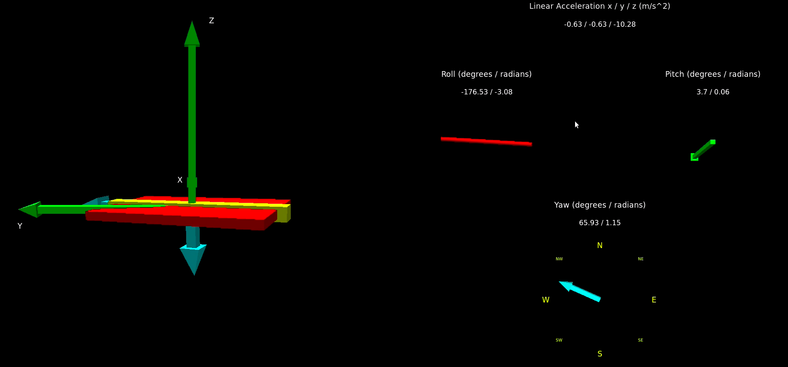

## TX2安装使用razor_imu_9dof

### 一、引言
自动驾驶中IMU起到了越来越重要的作用。

对于定位环节来说，首先，IMU不依赖于外界环境进行定位，只要精度高，漂移少，那么IMU提供的定位信息是很准的，而且频率也高。其次，IMU可以弥补GPS更新频率慢的问题，还可以用于辅助激光SLAM定位，例如为激光SLAM建图提供一个初始的位姿估计。但是IMU不同品质价格差异巨大，精度高的IMU可能达到几十万，而几百块钱的IMU也有，主要的差异还是在与IMU输出数值的漂移程度。因此，选择一款合适的IMU是必要的。

### 二、为什么选择这一款？
这款Sparkfun出品的9DOF Razor IMU是许多机器人项目组的常用选择，例如麻省理工大学的RACEAR项目组和宾大的F1/10 race car项目组都选用了这一款IMU。这款IMU对于自动驾驶模型实验车测试来说是可以使用的，但是实际上真正要用到自动驾驶车辆上肯定是不行的，一般都选用诺瓦泰(NovAtel)提供的解决方案。

总的来说，这款IMU集成了三个传感器，包括：
- 一个ITG-3200三轴陀螺仪，提供角速度
- 一个ADXL345三轴加速度计，提供线加速度
- 一个HMC5883L三轴磁力计，提供方位角

上面还搭载了一个ATmega328(arduino)处理器，通过串口输出IMU的信息。

而且，在ROS中对这款IMU的的支持比价好，可以在ROS获取这款IMU的ROS软件包( [razor_imu_9dof](http://wiki.ros.org/razor_imu_9dof) )。这个软件包里面包括了这个IMU的ROS驱动程序，还有用于生成AHRS(Attitude Heading Reporting System)信息发布的arduino固件，以及为这款IMU提供诊断信息的GUI。因此这款IMU使用起来是非常方便的，因此选用这一款IMU。

### 三、准备
使用之前还需要明确一下，除了一块前面所说的IMU板子，还需要一个USB转TTL的板子，这个是将IMU输出的串口信号转换为USB信号，然后给TX2接收。

如果不使用USB转TTL板，也可以使用TX2上面的GPIO直接接收IMU输出的串口信息，但是需要自己写一下IMU的驱动，不过因为ROS的[razor_imu_9dof](http://wiki.ros.org/razor_imu_9dof) 软件包已经写好了驱动，我们就直接使用它，按照ROS官方的推荐来，使用USB转TTL的方式。

还需要提一下，由于TX2的linux内核是裁剪过的，有些驱动没有，就比如我们之后要使用的USB转ttl(cp210x),因此还需要重新编译内核来添加这些驱动，不过幸好TX2上编译内核并不麻烦。

除此之外，还需要确保你的TX2上面已经安装了ROS，arduino

### 四、安装IMU软件包
首先要做的就是在你的TX2上安装Razor IMU ROS软件包

这里我们参考JetsonHacks的教程: [Razor IMU ROS INSTALL](https://www.jetsonhacks.com/2016/07/01/jetson-racecar-part-9-razor-imu-ros-install/) (需要科学上网)

```
git clone https://github.com/jetsonhacks/installRazorIMUROS.git
cd installRazorIMUROS
./setupCatkinWorkspace.sh jetsonbot
```
这一步是在‘～/jetsonbot’目录中创建了一个Catkin工作区，你也可以修改后面的jetsonbot为你自己的名字，不过创建的catkin工作区都是在～目录下面，如果不指定名字，那么就默认创建’～/catkin_ws’工作区。

下一步是安装razor_imu_9dof ROS软件包。正常是执行下面的脚本，不过里面的脚本命令是针对indigo版ROS的，我的ROS版本为kinetic，因此不执行下面的命令
```
./installRazor.sh （不执行这个脚本）
```
其实脚本里面就三句话
>安装IMU软件包
>
>sudo apt-get install ros-indigo-razor-imu-9dof -y
>
>安装python可视化，这个不安也可以
>
>sudo apt-get install python-visual python-wxgtk2.8 -y
>
>安装arduino用于烧写固件
>
>sudo apt-get install arduino arduino-core -y

我们一步一步执行，首先安装razor_imu_9dof ROS软件包，这里面两种方式，一种是源码安装，一种是命令行安装。
推荐使用源码安装，如下所示：
```
$ cd ~/jetsonbot/src
$ git clone https://github.com/KristofRobot/razor_imu_9dof.git
$ cd ..
$ catkin_make
```
这样razor_imu_9dof ROS软件包就装好了，然后在安装python可视化和arduino
```
sudo apt-get install python-visual python-wxgtk2.8 -y
sudo apt-get install arduino arduino-core -y
```
### 五、重新烧写IMU固件
重新烧写固件的目的是让IMU可以运行[AHRS(Attitude Heading Reporting System)](https://baike.baidu.com/item/AHRS)

设置环境变量
```
$ cd ~/jetsonbot
$ source devel/setup.bash
```
将arduino固件脚本复制到Arduino sketchbook目录：
```
$ mkdir -p ~/sketchbook/Razor_AHRS
$ roscd razor_imu_9dof
$ cp -r src/Razor_AHRS ~/sketchbook/Razor_AHRS
```
然后，打开〜/sketchbook/Razor_AHRS文件夹。双击Razor_AHRS.ino文件，它将打开Arduino软件（前提是你已经在TX2上面安装好了arduino)

在编辑器中的“editor” - “find”，查找‘Hardware Options’关键字,

取消注释掉10736那一行
```
#define HW__VERSION_CODE 10736 // SparkFun "9DOF Razor IMU" version "SEN-10736" (HMC5883L magnetometer)
```
然后执行以下步骤：
1. 到 “Tools” → “Board” 勾选 “Arduino Pro or Pro Mini (3.3v, 8mhz) w/ATmega328”.
2. 到 “Tools” → “Serial Port” 勾选 “/ttyUSB0”
3. 到 “File” 点击 “Upload”. 直到 Arduino code window 显示 “Done uploading”.

如果显示 Done uploading, 那么固件就烧写完毕了。

**这里可能会出现一个问题，就是第二步骤没有/ttyUSB0选项，这就是我前面提到的因为TX2的linux内核没有USB转TTL的驱动，因此需要重新编译内核，不过不用担心，整个步骤只需要三步，并不麻烦。**

首先确定你的USB转TTL是什么协议的，一般在你的USB转TTL板子上面会印上去，有的是FTDI，有的是CP201X，例如我的就是CP201X，这个信息我们在后面需要

#### 编译TX2内核
编译内核的目的就是加上我们想要的驱动

这里我们参考JetsonHacks的教程：[Build Kernel and ttyACM Module](https://www.jetsonhacks.com/2017/07/31/build-kernel-ttyacm-module-nvidia-jetson-tx2/)(需要科学上网)

首先，要确定现在你的TX2的内核版本是什么：
```
nvidia@tegra-ubuntu:~$ head -n 1 /etc/nv_tegra_release
# R28 (release), REVISION: 1.0, GCID: 9379712, BOARD: t186ref, EABI: aarch64, DATE: Thu Jul 20 07:59:31 UTC 2017
nvidia@tegra-ubuntu:~$
```
这里面就显示了，比如 “R28 (release), REVISION: 1.0” 就代表我的内核版本是28.1

为什么要确定自己目前的内核版本呢？是因为JetsonHacks的大神们写的编译内核脚本对于不同的内核版本是不一样的，我们git下来的时候，要选特定的分支来git clone
```
$ git clone https://github.com/jetsonhacks/buildJetsonTX2Kernel.git
$ cd buildJetsonTX2Kernel
$ git checkout vL4T28.1   #你自己的内核版本，要在这里修改哦，不过如果没选对，他会打印帮助信息的，告诉你选错了
```
好了，下面就开始编译内核，一共只需要三步：“把冰箱门打开，把大象....” 哦不对ヾ(´∀`o)+

分别是：获取内核源码，编译内核，拷贝新的启动镜像
```
$ ./getKernelSources.sh
```
这步执行完毕之后，会弹出一个配置config界面，我们就需要这个界面里面选择我们想要安装的驱动

首先我们可以给这个内核自定义一个名字：
找到Genral Setup 右侧的Local version - append to kernel release，双击，在下方文本框内输入我们自定义的名字，例如输入 jetsonbot-v0.1，然后回车，如下所示：


在工具栏edit-find输入ACM，勾选为勾：


接着输入CH341，勾选为点：


接着输入CP210, 接着FTDI，勾选为勾，这样我们加上了我们想要的USB转TTL的驱动，无论是CP210X还是FTDI


然后点击file-save保存配置，之后退出配置界面即可。

然后执行第二步和第三步
```
$ ./makeKernel.sh
$ ./copyImage.sh
```
这样内核编译就完成了，之后重新启动系统reboot.

插上usb转ttl，在打开之前的arduino软件，你就会发现之前没有的/ttyUSB0选项现在就有了

### 六、使用IMU
到目前位置，我们就已经在TX2上面安装好了IMU，我们可以使用IMU看看效果了。

设置环境变量
```
cd ~/jetsonbot
source ./devel/setup.bash
```
运行IMU节点
```
roslaunch razor_imu_9dof razor-pub.launch
```
查看当前话题
```
nvidia@tegra-ubuntu:~$ rostopic list
/diagnostics
/imu
/imu_node/parameter_descriptions
/imu_node/parameter_updates
/rosout
/rosout_agg
nvidia@tegra-ubuntu:~$
```
可以看到里面已经有了三个IMU相关的话题，打印/IMU话题看看
```
---
header:
  seq: 1417
  stamp:
    secs: 1544856523
    nsecs: 638345003
  frame_id: "base_imu_link"
orientation:
  x: 0.169973675484
  y: -0.171654651907
  z: -0.872121340293
  w: 0.425497353607
orientation_covariance: [0.0025, 0.0, 0.0, 0.0, 0.0025, 0.0, 0.0, 0.0, 0.0025]
angular_velocity:
  x: -0.04
  y: -0.12
  z: -0.03
angular_velocity_covariance: [0.02, 0.0, 0.0, 0.0, 0.02, 0.0, 0.0, 0.0, 0.02]
linear_acceleration:
  x: -1.41191078125
  y: 4.03999539062
  z: 8.00184921875
linear_acceleration_covariance: [0.04, 0.0, 0.0, 0.0, 0.04, 0.0, 0.0, 0.0, 0.04]
---

```
还可以可视化显示IMU的数据，运行：
```
roslaunch razor_imu_9dof razor-pub-and-dislay.launch
```
可以看到以下效果：


到此为止，在TX2上面已经可以使用razor-9dof 这款IMU ，我们就可以使用IMU来优化的我们代码了。Yeah!
