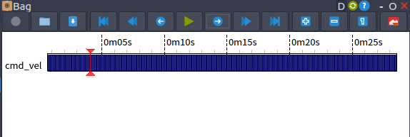

## rqt工具的使用

这里介绍一下ROS中无敌强大的rqt工具

#### 安装rqt工具
```
sudo apt-get install ros-indigo-rqt
sudo apt-get install ros-indigo-rqt-common-plugins
```
#### 运行rqt
```
rqt
```
进入上方菜单栏的Plugins，里面有很多十分有用的用于ROS调试的插件

下面简单列举一些十分有用的插件功能：

插件|功能描述
---|----|
topics monitor |可以监视当前的某一个话题的传输数据，占用带宽，话题频率等等，相当于我们原来的rostopic echo msg_name
message publisher|可以自定义名称发布一个话题，并且指定话题发布的消息类型，发布数据，以及发布频率
message type brower  | 可以查看当前所有已经定义的消息类型，包括自己定义的msg，基本相当于rosmsg show msg_name 的功能    |
robot steering  | 可以发布一个话题cmd_vel,发布Twist话题消息，可以可视化的修改速度，转角变量，用于测试一些控制指令十分方便
bag  | 可以用于录制一个bag文件包，可以任意选择指定录制哪些话题。也可以打开一个bag文件包，里面可以很方便的控制bag包play的播放或者暂停，同时可以指定播放前一帧和下一帧
bag插件如下图所示：



插件|功能描述
---|----|
node_graph  |  查看当前节点运行的所有节点 |
process monitor | 查看当前的所有节点，以及节点的PID，占用CPU，占用内存  |
launch  |  可以方便的在可视化界面下选择package和launch文件， 可以方便的运行和停止launch一个节点
image view| 可以很方便的查看ROS话题中传递的图片消息，这一点方便于我们观察机器人当前看到的图像
plot  | 可以将某一个话题的数据(全部数据或部分数据)进行绘图显示，这样可以更加直观看到话题消息的变化，方便于我们调试
tf tree  | 可以显示当前的tf树的结构
rviz  | 在rqt里面也集成了rviz工具，我们可以很方便的从这里打开rviz工具
